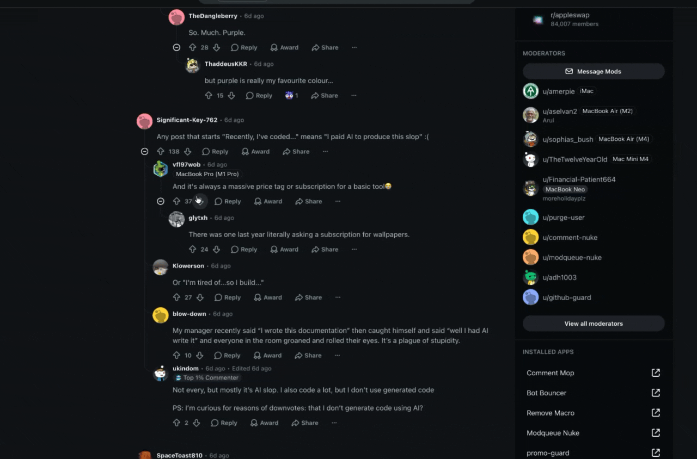

# Pawshot

A native macOS screenshot and screen recording tool. One hotkey, draw on it, ⌘C — done.



## Why

Apple has had years to ship a decent screenshot tool and still hasn't: nothing where one hotkey
drops you straight into editing and ⌘C / ⌘V just work. The alternatives are either half-baked or
want a subscription for drawing an arrow. Five, ten, twenty bucks — for *this*? Nope.

So I built my own. Native, free, a few megabytes, no account, no nagging. Grab it. Let's go.

- **⇧⌘2** a region, **⇧⌘1** the whole screen, **Space** a single window.
- Annotate with one key per tool — arrow, box, pen, text, blur, step counter — all undoable objects,
  on any keyboard layout.
- **⌘C** copies the image, **⌘S** saves a PNG, **⌘D** copies the *text* read off the shot.
- Missed by a few pixels? Drag the editor window's edge — the shot grows into the screen around it.
- **⇧⌘3** records a region, **⇧⌘4** the whole screen — with mic, system sound, click rings, shortcut
  captions, zooms and a pen that draws into the video.
- Stop, keep the pieces you want, get HEVC, 1080p or a GIF straight onto the clipboard.

## Build it yourself

You need macOS 26, Xcode 26 and [mise](https://mise.jdx.dev) (it pulls the pinned Tuist and
SwiftFormat on its own).

```sh
git clone https://github.com/CaramelHeaven/Pawshot.git && cd Pawshot
make install
```

`make install` builds Release, puts it into `/Applications` and launches it.

**Signing.** Without the local file the app is signed ad hoc — it works, but macOS asks for Screen
Recording again after every rebuild. A stable signature fixes that and needs no Apple account:
make a self-signed identity once and point the local config at it.

```sh
T=$(mktemp -d)
openssl req -x509 -newkey rsa:2048 -nodes -days 3650 -keyout "$T/k.pem" -out "$T/c.pem" \
  -subj "/CN=Pawshot Self-Signed" -addext "basicConstraints=critical,CA:false" \
  -addext "keyUsage=critical,digitalSignature" -addext "extendedKeyUsage=critical,codeSigning"
openssl pkcs12 -export -keypbe PBE-SHA1-3DES -certpbe PBE-SHA1-3DES -macalg sha1 \
  -inkey "$T/k.pem" -in "$T/c.pem" -name "Pawshot Self-Signed" -out "$T/p.p12" -passout pass:pawshot
security import "$T/p.p12" -k ~/Library/Keychains/login.keychain-db -P pawshot -A \
  -T /usr/bin/codesign
rm -rf "$T"
cp Config/Signing.local.xcconfig.example Config/Signing.local.xcconfig
```

The three `-keypbe/-certpbe/-macalg` flags matter with OpenSSL 3 (Homebrew's): its default `.p12`
is one macOS's `security import` rejects as "MAC verification failed". Your Apple Development
certificate and Team ID work too — see `Config/Signing.local.xcconfig.example`.

First run asks for **Screen Recording** (⇧⌘2) and **Desktop** access (⌘S). ⇧⌘3 / ⇧⌘4 belong to macOS
until you untick "Save picture of screen / selected area as a file" in System Settings → Keyboard →
Keyboard Shortcuts → Screenshots — Pawshot's Settings warns while they're still taken.

`make test` runs the tests, `make run` a Debug copy, `make uninstall` removes it, `make` lists
the rest.

## For AI agents

Read [`AGENTS.md`](AGENTS.md) first — the architecture, the hard rules and every trap already
stepped on, with measurements. `CLAUDE.md` only imports it. The short version:

- Tuist generates the project: `Project.swift` is the source of truth; after adding a file run
  `make generate`. Build and test through `make`, never a global `tuist`.
- SwiftFormat is mandatory — `make lint` must be clean.
- Coordinate math lives only in `SelectionGeometry`, covered by tests.
- Hotkeys, the overlay and anything you'd need eyes for can't be verified from a shell. Say so
  instead of writing "checked, works".
- Don't commit or push — leave the work in the tree for the owner to review.
