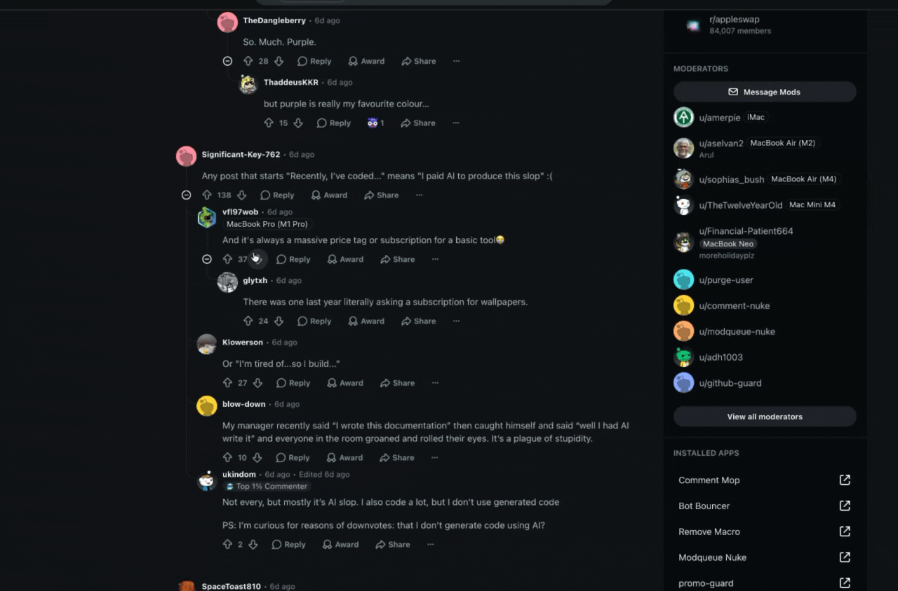

# Pawshot

A native macOS screenshot and screen recording tool. One hotkey, draw on it, ⌘C — done.



## Why

Apple has had years to ship a decent screenshot tool and still hasn't: nothing where one hotkey
drops you straight into editing and ⌘C / ⌘V just work. The alternatives are either half-baked or
want a subscription for drawing an arrow. Five, ten, twenty bucks — for *this*? Nope.

So I built my own. Native, free, a few megabytes, no account, no nagging. Grab it. Let's go.

Everything below is what 0.6.10 does. Every shortcut can be changed in Settings → Shortcuts.

## Screenshots

- **⇧⌘2** a region, **⇧⌘1** the whole screen at once, **Space** on the overlay picks a single
  window. **M** on the overlay is an 8× loupe with the pixel's HEX.
- The shot opens in the editor, one key per tool: **V** select, **A** line (again: arrow → double
  arrow → plain), **R** shape (again: circle → triangle → diamond → rectangle), **D** pen, **T**
  text, **B** blur, **N** step counter. Everything drawn stays an object: move it, restyle it,
  delete it, **⌘Z** it — on any keyboard layout, Cyrillic included.
- Lines bend into arcs and get heads at either end; shapes resize and turn by their handles; **⇧**
  snaps to 15° or keeps proportions. Four colours plus one of your own with an eyedropper, fills of
  any opacity, labels in any installed font with every weight it has.
- **⌘L / ⌘R** turn the selection — or, with nothing selected, the whole shot with everything on it.
- Missed by a few pixels? Drag the editor window's edge — the shot grows into the screen around it,
  from the same moment it was taken.
- **⌘C** copies the image, **⌘S** saves it to your folder (PNG, JPG or HEIC — Settings →
  Screenshots), **⇧⌘S** asks where, **⌘D** copies the *text* read off the shot, QR codes first.
  The window fades out the moment the result is out.
- **Esc** never closes a shot. **⌘Q** tapped closes the window (asking if you drew on it), held
  quits Pawshot.

## Recording

- **⇧⌘3** records a region, **⇧⌘4** the whole screen; the same shortcut stops. macOS uses both for
  its own screenshots until you untick them in Keyboard Shortcuts — the welcome window, Settings
  and the paw's menu all tell you while it still does.
- Picking the region doesn't freeze the screen. The last region comes back, moves, resizes and
  sticks to window edges; drop it on the target in a window's middle to take that window's frame.
  **A** cycles proportions, digits type an exact size (`1920x1080`), **H** draws zones that stay
  blurred for the whole video, **P** switches profiles (*Bug report*: GIF, clicks, no sound;
  *Demo*: HEVC 2x, voice). Options pick the microphone (with a live level and a three-second
  check), system sound, clicks, pressed shortcuts and the scale. A line above the toolbar warns
  about what would go wrong: a silent microphone, a shortcut macOS still holds, a nearly full disk.
- While it records, a pill by the area shows the time, what the take weighs so far and, if you set
  a target length, how far you are. On a MacBook with a notch it wraps around the notch.
  - **⇧⌘7** the pen: draw on the screen, into the video; every stroke fades after four seconds.
  - Hold **⌃⌘A** for a spotlight around the cursor, **⌃⌘B** to hide the picture (blurred in the
    video), **⌃⌘V** to mute the microphone.
  - **⌃⌘X** cuts the last 10 seconds — the take goes on, the editor opens with them already cut.
  - **⇧⌘5** restarts, **⇧⌘2** copies the frame being recorded. Paused, the region can be moved.
- Pawshot's own windows never end up in the video.

## Video editor

Stop, and the take opens in the editor: keep as many pieces as you want — each one sits in orange
brackets, the grey in between is cut — undo every change with **⌘Z**, switch the click rings,
shortcut captions, spotlight and hidden parts on or off. **P** picks the format (original HEVC,
1080p H.264 or a 720p GIF), **⌘C** puts the file on the clipboard, **⇧⌘C** a GIF whatever the
format, **⌘S** saves it. An export keeps running if you close the window.

## Everything else

- English and Russian, picked in Settings → General.
- After an update, a What's New window tells you what changed since the version you had — once.
- Settings → Statistics counts your shots, drawings and recordings, on this Mac only.
- **Collect Logs** (on by default, off in Settings → General → Diagnostics) keeps a log you can
  save or send by email when something goes wrong. It never holds what you typed or copied.
- Launch at login, once Pawshot is in Applications.

## Install

Pawshot needs macOS 26 (Tahoe). There is one way in:

1. Download `Pawshot-<version>.dmg` from the
   [latest release](https://github.com/CaramelHeaven/Pawshot/releases/latest).
2. Open it and drag Pawshot onto Applications.
3. Open Pawshot. The build isn't notarised, so macOS stops the first launch: go to System Settings →
   Privacy & Security, press **Open Anyway** and enter your password. This happens once — updates
   never ask again.
4. The welcome window lists everything Pawshot can use, each with its own button: **Screen
   Recording** is the one it needs; the microphone, Input Monitoring (shortcut captions in videos),
   freeing ⇧⌘3 / ⇧⌘4 from macOS's own screenshots and launch at login can wait. Press **Get
   Started**.

The paw in the menu bar means it is running. **⌘S** asks for the Desktop the first time it saves.

## Updates

Pawshot updates itself through [Sparkle](https://sparkle-project.org): it checks the releases here
once a day, or right away from the paw → **Check for Updates…**, and **Install and Relaunch** swaps
the app in place. No DMG, no Open Anyway, no password, and the permissions you gave it stay.

## Development

Building from source is for working on Pawshot, not for installing it. You need Xcode 26 and
[mise](https://mise.jdx.dev), which pulls the pinned Tuist and SwiftFormat on its own.

```sh
git clone https://github.com/CaramelHeaven/Pawshot.git && cd Pawshot
make run    # build a Debug copy and launch it
make test   # the unit tests
make        # every other target
```

<details>
<summary>A stable signature, so Screen Recording survives rebuilds</summary>

Out of the box the build is signed ad hoc, and macOS asks for Screen Recording again after every
rebuild. A self-signed identity fixes that and needs no Apple account:

```sh
T=$(mktemp -d)
openssl req -x509 -newkey rsa:2048 -nodes -days 3650 -keyout "$T/k.pem" -out "$T/c.pem" \
  -subj "/CN=Pawshot Self-Signed" -addext "basicConstraints=critical,CA:false" \
  -addext "keyUsage=critical,digitalSignature" -addext "extendedKeyUsage=critical,codeSigning"
openssl pkcs12 -export -keypbe PBE-SHA1-3DES -certpbe PBE-SHA1-3DES -macalg sha1 \
  -inkey "$T/k.pem" -in "$T/c.pem" -name "Pawshot Self-Signed" -out "$T/p.p12" -passout pass:pawshot
security import "$T/p.p12" -k ~/Library/Keychains/login.keychain-db -P pawshot -A \
  -T /usr/bin/codesign
rm -rf "$T"
cp Config/Signing.local.xcconfig.example Config/Signing.local.xcconfig
```

The three `-keypbe/-certpbe/-macalg` flags matter with OpenSSL 3 (Homebrew's): its default `.p12`
is one macOS's `security import` rejects as "MAC verification failed". An Apple Development
certificate works too — see `Config/Signing.local.xcconfig.example`.

</details>

Releases are the owner's: raise the version in `Project.swift`, commit, push, then
`make release publish` — it builds the DMG, signs the update with the key in the owner's Keychain
and puts both on GitHub, where every installed copy finds them.

## For AI agents

Read [`AGENTS.md`](AGENTS.md) first — the architecture, the hard rules and every trap already
stepped on, with measurements. `CLAUDE.md` only imports it. The short version:

- Tuist generates the project: `Project.swift` is the source of truth; after adding a file run
  `make generate`. Build and test through `make`, never a global `tuist`.
- SwiftFormat is mandatory — `make lint` must be clean.
- Coordinate math lives only in `SelectionGeometry`, covered by tests.
- Hotkeys, the overlay and anything you'd need eyes for can't be verified from a shell. Say so
  instead of writing "checked, works".
- Don't commit or push — leave the work in the tree for the owner to review.
